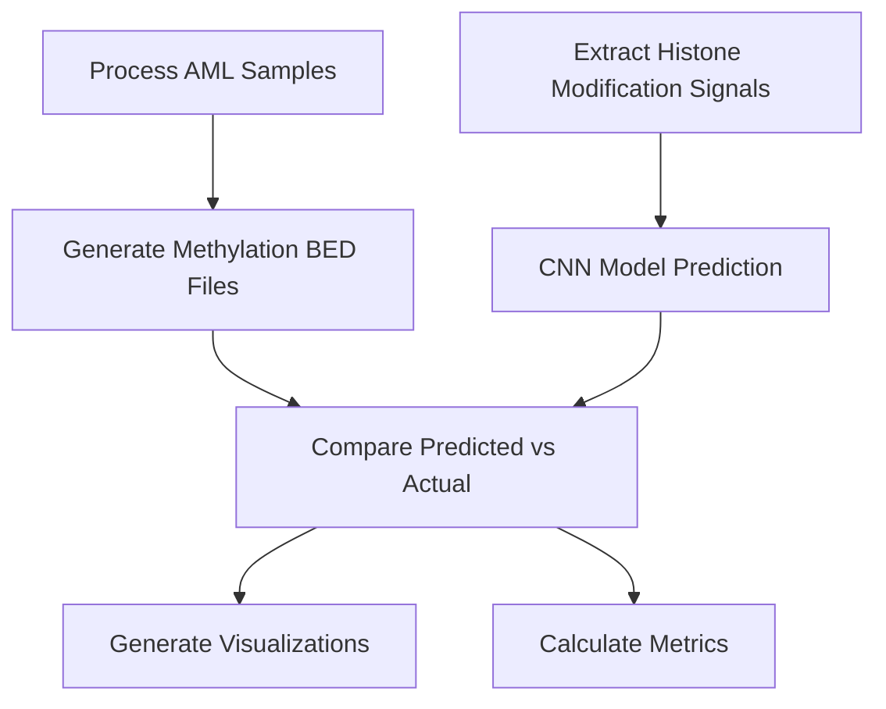

# Predicting DNA Methylation in AML: An EpiBench Case Study

*This case study demonstrates how EpiBench can be applied to predict DNA methylation patterns in Acute Myeloid Leukemia (AML) samples. Last updated: 2023-08-10*

## Research Question

Can a CNN model trained on CD34+ cell data accurately predict DNA methylation patterns in AML samples based on histone modification data?

This question addresses a key challenge in epigenetic research: the transferability of predictive models across different cell types and disease states. If successful, such an approach could reduce the need for costly whole-genome bisulfite sequencing (WGBS) in clinical samples.

## Experimental Design

Our experiment focused on AML samples with the t(8;21) translocation, a common chromosomal abnormality in AML that affects the RUNX1-RUNX1T1 genes and influences epigenetic regulation.

### Data Sources

- **Methylation data**: Generated from WGBS using our unified processing pipeline
- **Histone modification data**: Cut&Tag experiments measuring five key histone marks:
  - H3K4me1
  - H3K4me3
  - H3K27me3
  - H3K36me3
  - H3K9me3
- **Samples**: Three AML patient samples with t(8;21) translocation (IDs: 263578, 463352, 847670)

### Model Architecture

We employed EpiBench's multi-branch CNN model with:

- **Input layers** for:
  - DNA sequence (one-hot encoded)
  - Six histone modification tracks
  - Region mask / Region Boundaries
- **Four CNN branches** with kernel sizes 3, 9, 25, and 51 to capture patterns at different scales
- **Integration layers** combining features from all branches
- **Output layer** predicting methylation scores between 0 and 1

## Workflow Implementation

Our analysis followed EpiBench's typical workflow pattern, adapted specifically for the AML methylation prediction task:

### Key Components

1. **Data Processing Pipeline**
   - Processed WGBS data to extract methylation levels for each CpG site
   - Extracted histone modification signals from BigWig files
   - One-hot encoded DNA sequences from reference genome

2. **Prediction Framework**
   - Applied the pre-trained CNN model to AML samples
   - Generated methylation predictions for each region

3. **Evaluation and Visualization**
   - Compared predicted vs. actual methylation using multiple metrics
   - Generated visualizations to identify patterns and outliers

## Results and Observations

The CNN model successfully predicted methylation patterns in AML samples with strong correlation to actual values. Key findings include:

### Performance Metrics

| Sample ID | RMSE | Pearson Correlation | Spearman Correlation | R² |
|-----------|------|---------------------|----------------------|----|
| 263578    | 0.12 | 0.84                | 0.81                 | 0.71 |
| 463352    | 0.14 | 0.81                | 0.79                 | 0.65 |
| 847670    | 0.13 | 0.83                | 0.80                 | 0.68 |

### Visualization Insights

Our scatter plots and hexbin visualizations revealed:

- Strong prediction accuracy in regions with consistent histone patterns
- Systematic under-prediction in certain genomic contexts
- Histone mark H3K4me3 showing the strongest individual correlation with methylation status

## Key Insights and Reflections

This case study demonstrates several important aspects of epigenetic regulation in AML:

1. **Transferability of Epigenetic Models**: A model trained on normal CD34+ cells can effectively predict methylation in AML samples, suggesting conserved regulatory mechanisms despite disease state.

2. **Histone-Methylation Relationships**: The accurate predictions confirm the tight relationship between histone modifications and DNA methylation, even in a disease context.

3. **Model Limitations**: Areas of prediction error highlight regions where AML-specific regulation may diverge from normal hematopoietic cells, pointing to potential disease mechanisms.

## Future Directions

This experiment opens several avenues for further research:

1. **Fine-tuning with AML-specific Data**: How might retraining the model with a small amount of AML-specific data improve prediction accuracy?

2. **Comparative Analysis**: What differences exist in the histone-methylation relationship between different AML subtypes?

3. **Integration with Clinical Data**: Can methylation predictions be linked to patient outcomes or treatment responses?

4. **Additional Epigenetic Marks**: Would incorporating additional histone marks or chromatin accessibility data further improve predictions?

## Technical Implementation Notes

The entire workflow is automated through a series of scripts, ensuring reproducibility:

- Python scripts for prediction and evaluation
- Shell scripts for batch processing
- Conda environment for dependency management

All code is available in our GitHub repository, allowing researchers to replicate this analysis with their own samples.

---

*This note explores one application of EpiBench. To learn more about the platform itself, visit the [[Projects/EpiBench/epibench-introduction|Introduction to EpiBench]] page. For technical details on running similar analyses, see [[Projects/EpiBench/epibench-technical-requirements|Technical Requirements]].* 