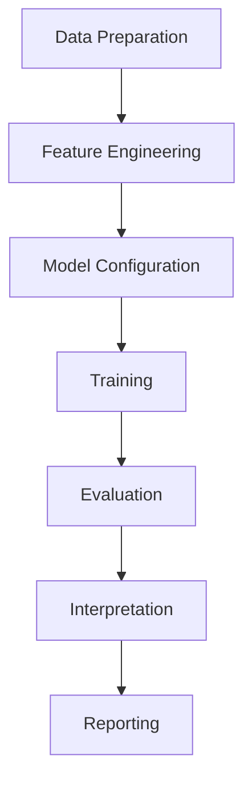

# EpiBench Workflow: A Step-by-Step Guide


*This note walks through a typical EpiBench workflow from data preparation to results interpretation. Last updated: 2024-11-20*

## Overview

A standard EpiBench analysis follows a consistent workflow regardless of the specific research question. This guide walks through each step of the process, providing code examples and decision points.



## 1. Data Preparation

The first step involves gathering and preparing your data for analysis.

### Loading Genomic Sequences

```python
from epibench.data import SequenceLoader

# Initialize the sequence loader with reference genome
seq_loader = SequenceLoader(
    reference_genome="path/to/hg38.fa",
    context_size=1000  # Extract 1000bp around each region
)

# Load sequences for regions of interest
sequences = seq_loader.load_from_bed(
    bed_file="path/to/regions.bed",
    centered=True  # Center sequences on BED file coordinates
)
```

### Loading Epigenetic Data

```python
from epibench.data import HistoneLoader, MethylationLoader

# Load histone modification data
histone_loader = HistoneLoader()
histone_data = histone_loader.load_multiple_marks(
    bigwig_files={
        "H3K4me3": "path/to/H3K4me3.bw",
        "H3K27ac": "path/to/H3K27ac.bw",
        "H3K27me3": "path/to/H3K27me3.bw",
        "H3K9me3": "path/to/H3K9me3.bw"
    },
    regions=regions,  # Regions from previous step
    bin_size=10  # Resolution of signal extraction
)

# Load methylation data (if performing methylation prediction)
methyl_loader = MethylationLoader()
methylation_data = methyl_loader.load_from_bed(
    bed_file="path/to/methylation.bed",
    score_column=4  # Column containing methylation values
)
```

### Data Integration

```python
from epibench.data import DataIntegrator

# Combine sequence and histone data
integrator = DataIntegrator()
integrated_data = integrator.combine(
    sequences=sequences,
    histone_data=histone_data,
    methylation_data=methylation_data
)

# Split data into training, validation, and test sets
train_data, val_data, test_data = integrator.train_val_test_split(
    integrated_data,
    train_ratio=0.7,
    val_ratio=0.15,
    test_ratio=0.15,
    random_state=42
)
```

## 2. Feature Engineering

Next, transform raw data into machine learning-friendly features.

### Sequence Feature Extraction

```python
from epibench.features import SequenceFeatureExtractor

# Create one-hot encoded features from DNA sequences
seq_extractor = SequenceFeatureExtractor()
seq_features = seq_extractor.one_hot_encode(sequences)

# Optional: extract additional sequence features
kmer_features = seq_extractor.extract_kmers(
    sequences, 
    k=3,  # Trinucleotide features
    include_counts=True
)
```

### Histone Feature Processing

```python
from epibench.features import HistoneFeatureProcessor

# Process histone signals
histone_processor = HistoneFeatureProcessor()
histone_features = histone_processor.normalize_and_process(
    histone_data,
    normalization="min_max",  # Options: min_max, z_score, quantile
    smoothing_window=3  # Optional signal smoothing
)
```

## 3. Model Configuration

Configure your machine learning model based on your research question.

### CNN Model Setup

```python
from epibench.models import MultibranchCNN

# Initialize the model
cnn_model = MultibranchCNN(
    sequence_length=1000,  # Must match your context size
    n_histone_marks=4,     # Number of histone marks
    kernel_sizes=[3, 5, 7], # Multiple kernel sizes for pattern detection
    conv_channels=128,     # Number of convolutional channels
    dropout_rate=0.3,      # Regularization parameter
    task="regression"      # Options: regression, classification
)

# Configure training parameters
cnn_model.configure_training(
    learning_rate=0.001,
    batch_size=64,
    n_epochs=100,
    early_stopping=True,
    patience=10  # Stop if no improvement for 10 epochs
)
```

### Alternative Models

For comparison or different research questions, you might want to try other models:

```python
# For traditional machine learning approach
from epibench.models import RandomForestModel

rf_model = RandomForestModel(
    n_estimators=100,
    max_depth=None,
    random_state=42,
    task="regression"
)

# For a different deep learning architecture
from epibench.models import BiLSTMModel

lstm_model = BiLSTMModel(
    sequence_length=1000,
    n_histone_marks=4,
    hidden_size=128,
    n_layers=2,
    dropout_rate=0.3,
    task="regression"
)
```

## 4. Training Process

Train your configured model using the prepared data.

```python
# Create data loaders
train_loader, val_loader, test_loader = cnn_model.create_data_loaders(
    train_data, val_data, test_data
)

# Train the model
training_history = cnn_model.train(
    train_loader=train_loader,
    val_loader=val_loader,
    save_best=True,
    model_save_path="models/best_model.pt",
    verbose=True
)

# Visualize training progress
from epibench.visualization import TrainingVisualizer

viz = TrainingVisualizer()
viz.plot_training_history(training_history)
viz.save("training_history.png")
```

## 5. Evaluation

Assess your model's performance on test data.

```python
# Evaluate on test set
test_metrics = cnn_model.evaluate(test_loader)

print(f"Test MSE: {test_metrics['mse']:.4f}")
print(f"Test R²: {test_metrics['r2']:.4f}")
print(f"Test Pearson correlation: {test_metrics['pearson']:.4f}")

# Generate predictions
predictions = cnn_model.predict(test_loader)

# Compare predictions with actual values
from epibench.visualization import PredictionVisualizer

pred_viz = PredictionVisualizer()
pred_viz.scatter_plot(
    actual=test_data.methylation_values,
    predicted=predictions,
    title="Predicted vs Actual Methylation",
    save_path="prediction_scatter.png"
)

pred_viz.density_hexbin(
    actual=test_data.methylation_values,
    predicted=predictions,
    title="Density of Predictions",
    save_path="prediction_density.png"
)
```

## 6. Interpretation

Use EpiBench's explainability tools to understand what drives your model's predictions.

```python
from epibench.interpret import IntegratedGradientsExplainer

# Initialize the explainer
explainer = IntegratedGradientsExplainer(model=cnn_model)

# Select a sample for explanation
sample_idx = 42
sample = test_data[sample_idx]

# Generate attribution scores
attributions = explainer.explain(
    sequence=sample.sequence,
    histone_data=sample.histone_data,
    n_steps=50  # Number of steps for integral approximation
)

# Visualize attributions
from epibench.visualization import AttributionVisualizer

attr_viz = AttributionVisualizer()
attr_viz.sequence_attribution_plot(
    sequence=sample.sequence,
    attributions=attributions.sequence_attributions,
    window_size=50,  # Show 50bp at a time
    save_path="sequence_attribution.png"
)

attr_viz.histone_attribution_plot(
    histone_data=sample.histone_data,
    attributions=attributions.histone_attributions,
    mark_names=["H3K4me3", "H3K27ac", "H3K27me3", "H3K9me3"],
    save_path="histone_attribution.png"
)
```

### Motif Discovery

Identify important sequence patterns:

```python
from epibench.interpret import MotifDiscovery

# Initialize motif discovery
motif_finder = MotifDiscovery()

# Find motifs from high-attribution regions
motifs = motif_finder.discover_motifs_from_attributions(
    sequences=test_data.sequences,
    attributions=all_attributions.sequence_attributions,
    top_percentile=95,  # Consider top 5% of attributions
    motif_length=8
)

# Visualize motifs
motif_finder.plot_motifs(
    motifs,
    save_path="discovered_motifs.png"
)
```

## 7. Reporting

Generate comprehensive reports of your analysis.

```python
from epibench.reporting import HTMLReportGenerator

# Initialize the report generator
report_gen = HTMLReportGenerator(
    title="Methylation Prediction Analysis",
    author="Your Name",
    date="2023-09-05"
)

# Add sections to the report
report_gen.add_introduction(
    text="This report presents the results of our methylation prediction analysis using EpiBench."
)

report_gen.add_model_description(model=cnn_model)
report_gen.add_performance_metrics(metrics=test_metrics)
report_gen.add_figure(path="prediction_scatter.png", caption="Predicted vs Actual Methylation")
report_gen.add_figure(path="prediction_density.png", caption="Density of Predictions")
report_gen.add_figure(path="sequence_attribution.png", caption="Sequence Attribution Example")
report_gen.add_figure(path="histone_attribution.png", caption="Histone Attribution Example")
report_gen.add_figure(path="discovered_motifs.png", caption="Discovered Sequence Motifs")

# Generate the report
report_gen.generate("methylation_prediction_report.html")
```

## Common Workflow Variations

### Classification Instead of Regression

If you're classifying regions rather than predicting continuous values:

```python
# Change the task type when initializing the model
cnn_model = MultibranchCNN(
    # ... other parameters ...
    task="classification",
    n_classes=2  # Binary classification
)

# Evaluation metrics will change accordingly
classification_metrics = cnn_model.evaluate(test_loader)
print(f"Accuracy: {classification_metrics['accuracy']:.4f}")
print(f"AUC: {classification_metrics['auc']:.4f}")
print(f"F1 Score: {classification_metrics['f1']:.4f}")
```

### Transfer Learning

To apply a pre-trained model to new data:

```python
# Load a pre-trained model
from epibench.models import load_model

pretrained_model = load_model("path/to/pretrained_model.pt")

# Freeze feature extraction layers
pretrained_model.freeze_feature_layers()

# Fine-tune on new data
fine_tuning_history = pretrained_model.train(
    train_loader=new_train_loader,
    val_loader=new_val_loader,
    n_epochs=20,
    learning_rate=0.0001  # Lower learning rate for fine-tuning
)
```

## Best Practices and Tips

1. **Data Quality Control**:
   - Always check for missing values or outliers in your data
   - Verify that genomic coordinates use the same reference build
   - Normalize histone signals to account for experimental variation

2. **Model Selection**:
   - Start with simpler models to establish baselines
   - Consider your dataset size when choosing model complexity
   - Use validation performance for hyperparameter tuning

3. **Interpretability**:
   - Always validate discovered motifs against known biological patterns
   - Consider biological context when interpreting attribution results
   - Compare attributions across multiple samples for robustness

4. **Computational Efficiency**:
   - Use GPU acceleration for model training when available
   - Process data in batches for large datasets
   - Save intermediate results to avoid recomputation

---

*This workflow guide provides a starting point for EpiBench analyses. For technical setup details, see [[Projects/EpiBench/epibench-technical-requirements|Technical Requirements]]. For a real-world application, check out the [[Projects/EpiBench/epibench-aml-case-study|AML Case Study]].* 